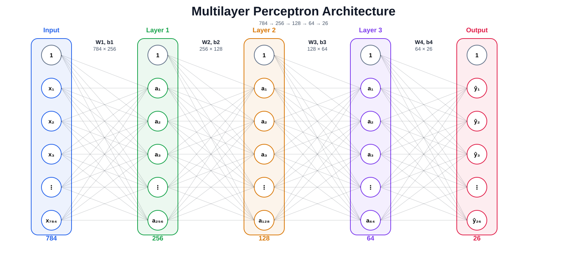
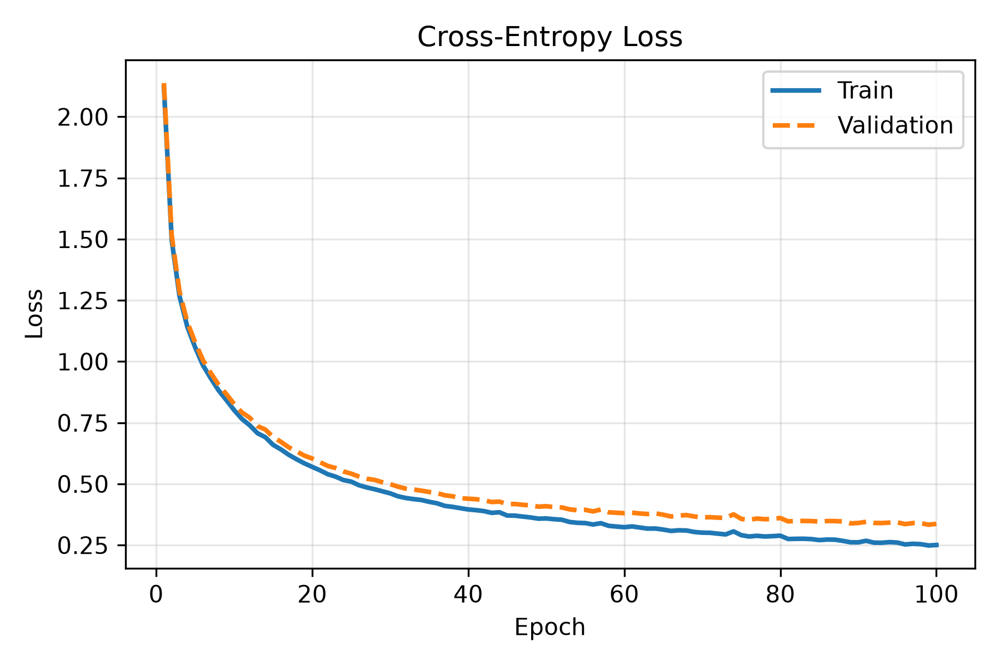
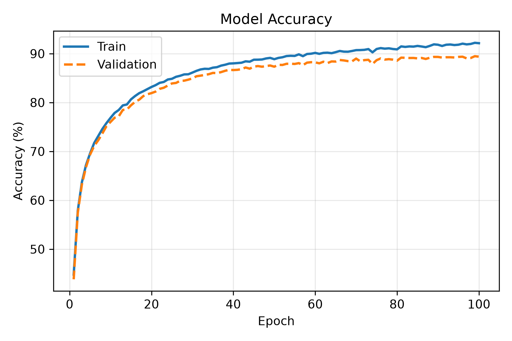
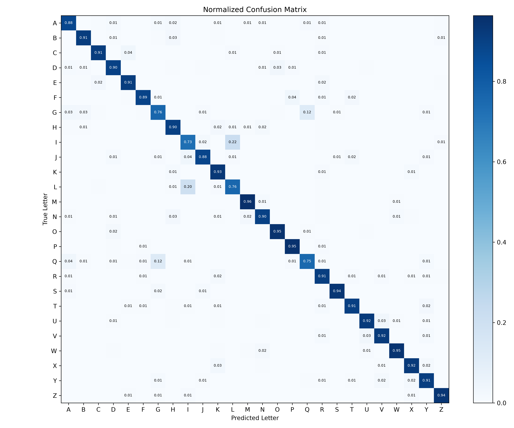
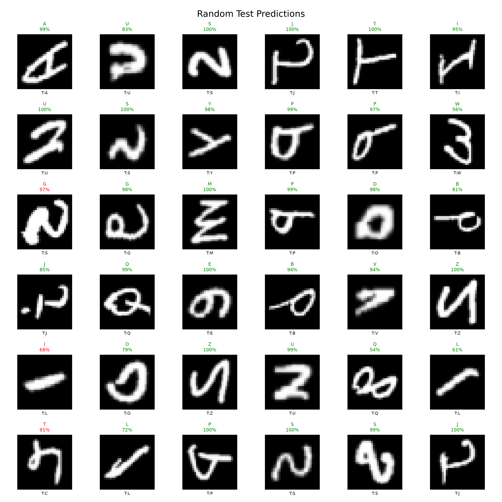
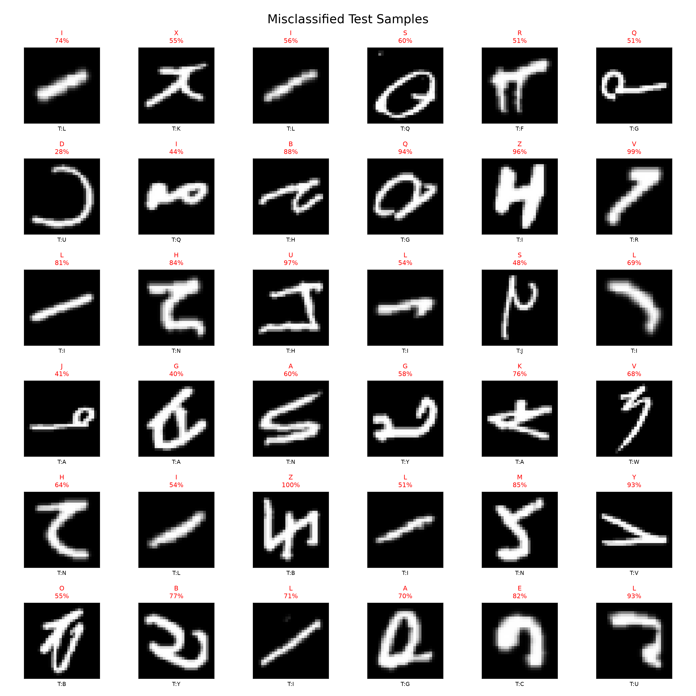
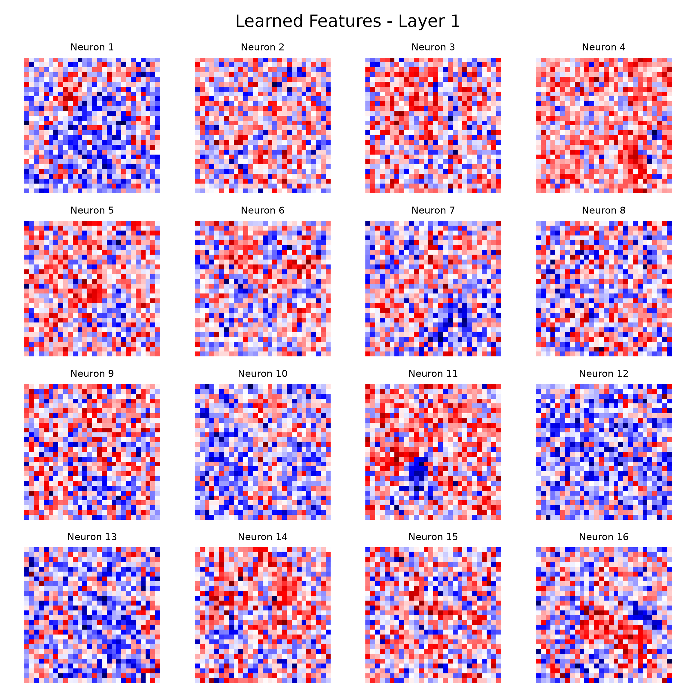

# Neural Network From Scratch

A fully connected **Multilayer Perceptron (MLP)** built entirely with **NumPy**, without TensorFlow or PyTorch. This project implements forward propagation, backpropagation, stochastic gradient descent, and visualization utilities from scratch for handwritten alphabet recognition using the **EMNIST Letters** dataset.

<p align="center">
  
</p>

---

## Project Overview

This implementation recreates the complete training pipeline of a neural network using only linear algebra and NumPy.

**Architecture**

> **784 → 256 → 128 → 64 → 26**

- **Input:** 28×28 grayscale image (784 pixels)
- **Hidden Layers:** 256, 128, 64 neurons
- **Activation:** ReLU
- **Output:** 26 classes (A–Z)
- **Loss:** Softmax + Cross Entropy
- **Optimizer:** Stochastic Gradient Descent (SGD)

---

## Features

- Dense layer implemented from scratch
- He (Kaiming) weight initialization
- ReLU activation
- Numerically stable Softmax
- Cross Entropy Loss
- Manual Backpropagation
- Mini-batch SGD optimizer
- Training & validation loop
- Confusion matrix visualization
- Prediction gallery
- Misclassified sample visualization
- Learned feature visualization

---

## Repository Structure

```text
NeuralNetworkFromScratch/
│
├── data/
│   ├── raw/
│   └── processed/
│
├── images/
│   ├── architecture_mlp.svg
│   ├── training_loss.png
│   ├── training_accuracy.png
│   ├── confusion_matrix.png
│   ├── predictions.png
│   ├── misclassified.png
│   └── layer1_weights.png
│
├── src/
│   ├── data_loader.py
│   ├── layers.py
│   ├── activations.py
│   ├── losses.py
│   ├── model.py
│   ├── optimizer.py
│   ├── visualization.py
│   └── train.py
│
├── README.md
└── requirements.txt
```

---

## Dataset

**EMNIST Letters**

| Split | Samples |
|-------|--------:|
| Train | 112,320 |
| Validation | 12,480 |
| Test | 20,800 |

- Image size: **28×28**
- Classes: **26 (A–Z)**

---

## Mathematical Formulation

The network is implemented from first principles using matrix operations and gradient-based optimization.

### 1. Dense Layer

For each layer, the linear transformation is

$$
Z = XW + b
$$

where:

- $X$ — input matrix
- $W$ — weight matrix
- $b$ — bias vector
- $Z$ — pre-activation output

---

### 2. ReLU Activation

The hidden layers use the Rectified Linear Unit:

$$
A = \max(0, Z)
$$

This introduces non-linearity while keeping the gradient computation simple.

---

### 3. Softmax Output

The output layer converts logits into class probabilities:

$$
\hat{y}_i =
\frac{e^{z_i}}
{\sum_{j=1}^{26} e^{z_j}}
$$

A numerically stable implementation subtracts the maximum logit before exponentiation.

---

### 4. Cross-Entropy Loss

The objective minimized during training is

$$
J = -
\frac{1}{m}
\sum_{i=1}^{m}
y_i \log(\hat{y}_i)
$$

where $m$ is the batch size.

---

### 5. Backpropagation

For the combination of **Softmax + Cross Entropy**,

$$
dZ = \hat{y} - y
$$

The gradients of the Dense layer are

$$
dW = \frac{1}{m} X^T dZ
$$

$$
db = \frac{1}{m}\sum dZ
$$

and the gradient propagated to the previous layer is

$$
dX = dZ W^T
$$

## Training Results

| Metric | Value |
|---------|------:|
| Test Accuracy | **89.21%** |
| Test Loss | **0.3496** |
| Optimizer | SGD |
| Learning Rate | 2.0 |
| Epochs | 100 |
| Batch Size | 128 |

---

## Training Curves

| Loss | Accuracy |
|------|------|
|  |  |

---

## Confusion Matrix

<p align="center">
  
</p>

---

## Sample Predictions

<p align="center">
  
</p>

Green labels indicate correct predictions, while red labels indicate incorrect ones.

---

## Misclassified Examples

<p align="center">
  
</p>

These examples help identify confusing character pairs learned by the model.

---

## Learned Features

The first hidden layer learns stroke and edge detectors directly from pixel values.

<p align="center">
  
</p>

---

## How to Run

### Install dependencies

```bash
pip install -r requirements.txt
```

### Train the model

```bash
cd src
python train.py
```

All visualizations will be automatically saved inside the **images/** directory.

---

## Implementation Details

| Component | Implemented |
|-----------|-------------|
| Dense Layer | NumPy |
| ReLU | NumPy |
| Softmax | NumPy |
| Cross Entropy | NumPy |
| Backpropagation | Manual |
| SGD Optimizer | Manual |
| Mini-batching | Yes |
| Visualization | Matplotlib |

---

## Future Improvements

- [ ] Adam Optimizer
- [ ] Learning Rate Scheduling
- [ ] Dropout Regularization
- [ ] Batch Normalization
- [ ] TensorFlow implementation for comparison
- [ ] Gradient Checking

---

## Author

**Dipanshu Raj**

Built as part of a Machine Learning From Scratch series focused on understanding the mathematics and implementation of deep learning without high-level frameworks.
